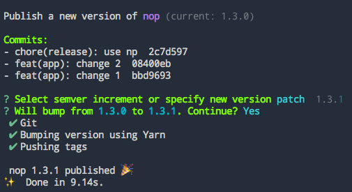

# Jest Angular Schematic

## Getting started

```shell
npm install && npm run link
```

## Development

### Test schematic changes against this repositories Angular CLI sandbox

When running locally, schematic changes will be applied to the test app in the `./sandbox` directory. The sandbox is a bare CLI app and serves no other purpose than for testing schematics changes.

Compile the typescript in watch mode in one shell:

```shell
npm run build
```

Run the following in another shell every time a schematic change is made:

```shell
npm run clean:launch
```

`clean:launch` will reset the sandbox to is current version controlled state, removing un-tracked files, and run the schematic against the sandbox. This will be your main development command.

⚠ **Be careful not to check in changes to the sandbox directory unless necessary.** ⚠

### Test schematics against a local project

- run `npm run build` to compile the schematic in watch mode
- open another shell, cd into the local repo you want to run the schematic against, and run `npm link ../PATH_TO_THIS_PROJECT`
  - this will symlink the projects so that the Jest schematic command runs from you're local filesystem
- in the local repo you want to run the schematic against, run `ng g @briebug/jest:jest`

### Dev tips

For faster developing, find and comment out the following line to avoid npm installing dependencies

```ts
context.addTask(new NodePackageInstallTask());
```

### Reset sandbox to its version controlled state

This will reset the sandbox folder to its `HEAD` commit and remove un-tracked files.

```shell
npm run clean
```

### Compile the schematics

Compile the typescript files in watch mode

```shell
npm run build
```

Compile the typescript files once

```shell
npm run build:once
```

## Testing

### Test local sandbox for regressions

Run a series of standard tests to ensure the `./sandbox` continues to function normally

```shell
npm run teat:sandbox
```

## Getting Started With Schematics

This repository is a basic Schematic implementation that serves as a starting point to create and publish Schematics to NPM.

### Schematic Testing

To test locally, install `@angular-devkit/schematics` globally and use the `schematics` command line tool. That tool acts the same as the `generate` command of the Angular CLI, but also has a debug mode.

Check the documentation with

```bash
schematics --help
```

### Unit Testing

`npm run test` will run the unit tests, using Jasmine as a runner and test framework.

### Publishing

Publishing is handled by [np](https://github.com/sindresorhus/np#usage). Ensure you have push access to this repo and are a [@breibug](https://www.npmjs.com/settings/briebug/packages) NPM contributor. Several [options](https://github.com/sindresorhus/np#usage) are available for releases such as `npm run release --no-publish`.

Once all features are merged into `master`:

1. on your machine, checkout `master`
2. pull latest
3. `npm run release`
4. select the next appropriate version given the changes being added
5. copy the `Commits:` displayed in your shell
  
6. edit the new release tag, and paste in the change notes and supply a title if appropriate
  

## Documentation

- [Schematics README](https://github.com/angular/angular-cli/blob/master/packages/angular_devkit/schematics/README.md)
- [Angular CLI schematic examples](https://github.com/angular/angular-cli/blob/master/packages/schematics/angular/app-shell/index.ts)

## Common solutions

### node-package

If you receive the following error and are on Angular CLI 1.X, trying moving to `"@angular/cli": "1.7"` or higher.

```shell
Error: Unregistered task "node-package" in schematic ...
```